# Highly Available AWS 2-Tier Architecture with VPC Peering

Automated deployment of an isolated, multi-VPC, highly available 2-Tier web infrastructure in the **Stockholm (`eu-north-1`)** region using **Terraform (IaC)**. Configured strictly within AWS Free Tier limits.

---

## Architecture Overview

* **Tier 1 (Presentation / Ingress Layer):** An Internet-facing Application Load Balancer (ALB) distributed across two Availability Zones (`eu-north-1a` and `eu-north-1b`).
* **Tier 2 (Application / Compute Layer):** Two Apache web servers hosted on `t3.micro` EC2 instances in separate public subnets, protected by security groups that only permit HTTP ingress directly from the ALB.
* **Isolated Customer VPC & Peering:** A separate private VPC (`11.0.0.0/16`) connected via AWS VPC Peering for non-internet, cross-VPC communication.


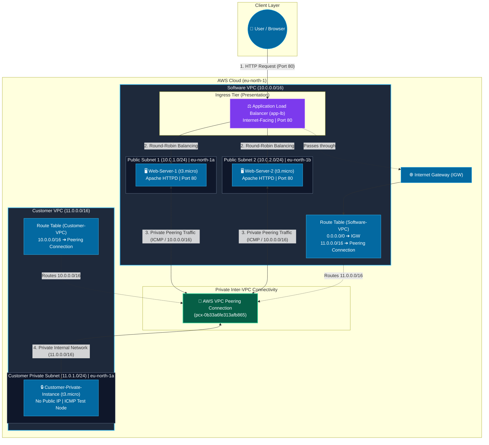


---

## Verification & Proof of Deployment

### 1. Terraform Deployment Output
Automated provisioning of resources via Terraform CLI:
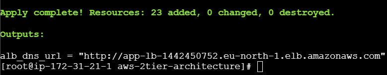

### 2. Network Infrastructure (VPCs & Subnets)
Two isolated VPCs provisioned (`Software-VPC` and `Customer-VPC`):
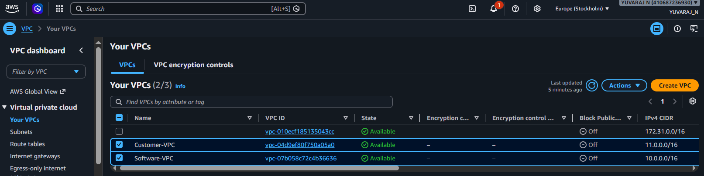

Subnets spanning multiple Availability Zones for high availability:
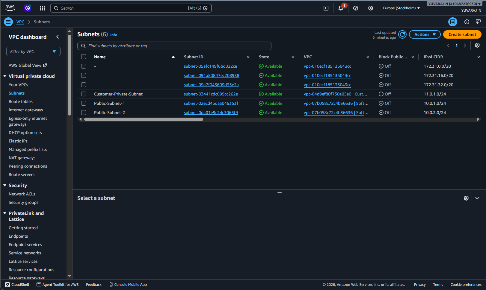

### 3. VPC Peering & Routing
Active peering connection enabling private cross-VPC communication:
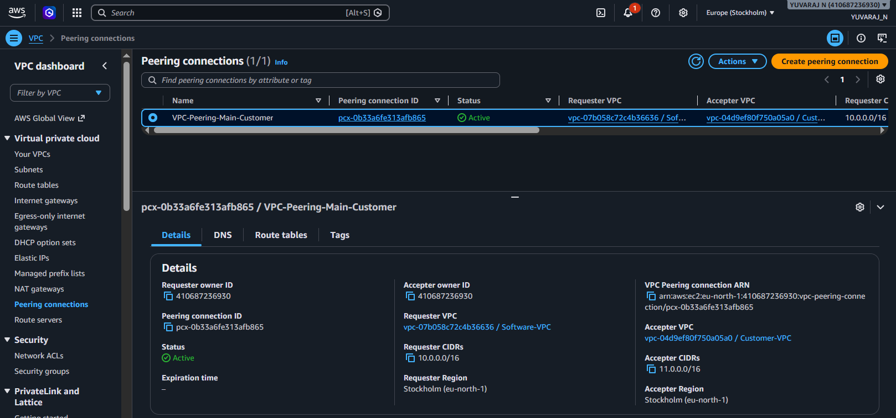

Software VPC route table configured with default Internet Gateway and peering routes:
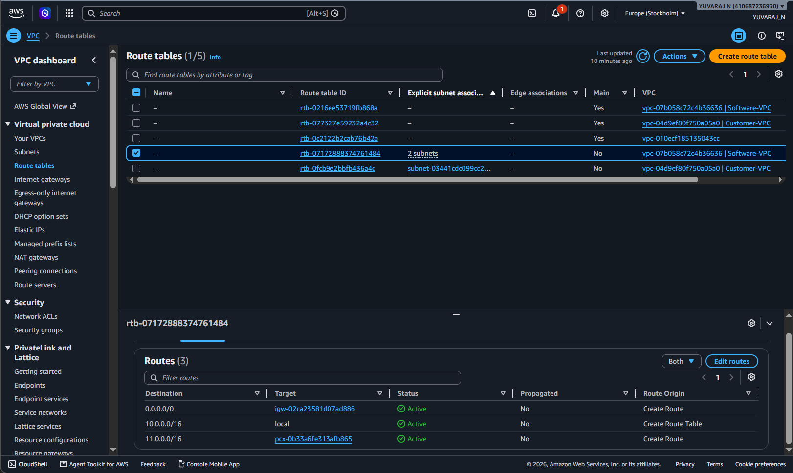

Customer VPC route table directing return traffic back across the peering connection:
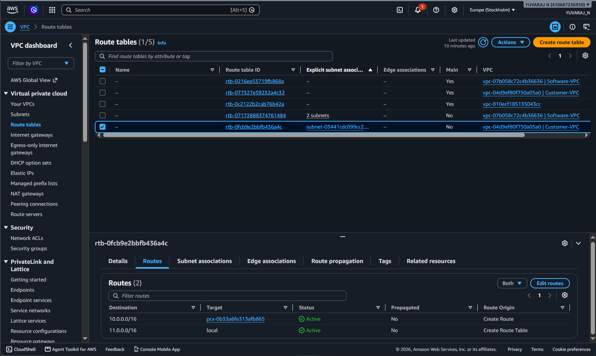

### 4. Security Configuration
Security groups restricting compute access exclusively to the load balancer and internal ICMP traffic:
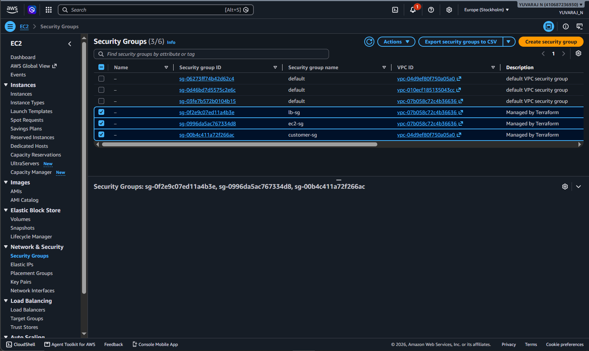

### 5. Compute Tier (EC2 Instances)
Three running `t3.micro` instances across both VPCs:
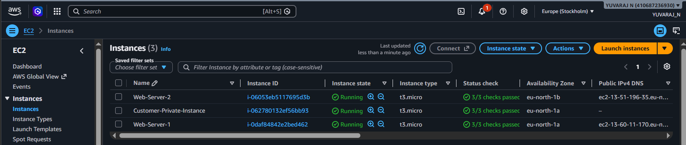

### 6. Load Balancer & Health Checks
Application Load Balancer Target Group showing all registered web servers healthy on port 80:
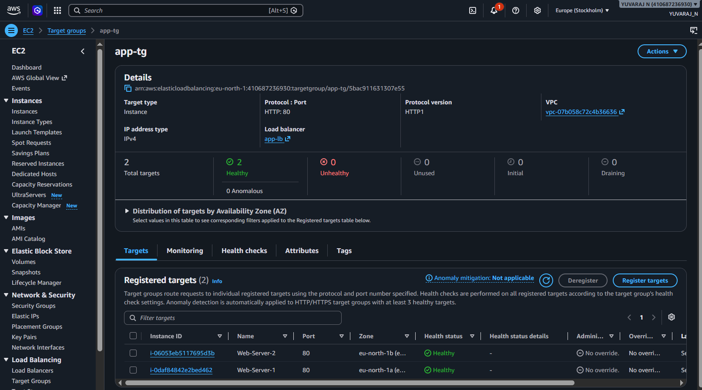

### 7. End-to-End Traffic Balancing Verification
Accessing the ALB DNS endpoint demonstrates round-robin traffic distribution between both instances:
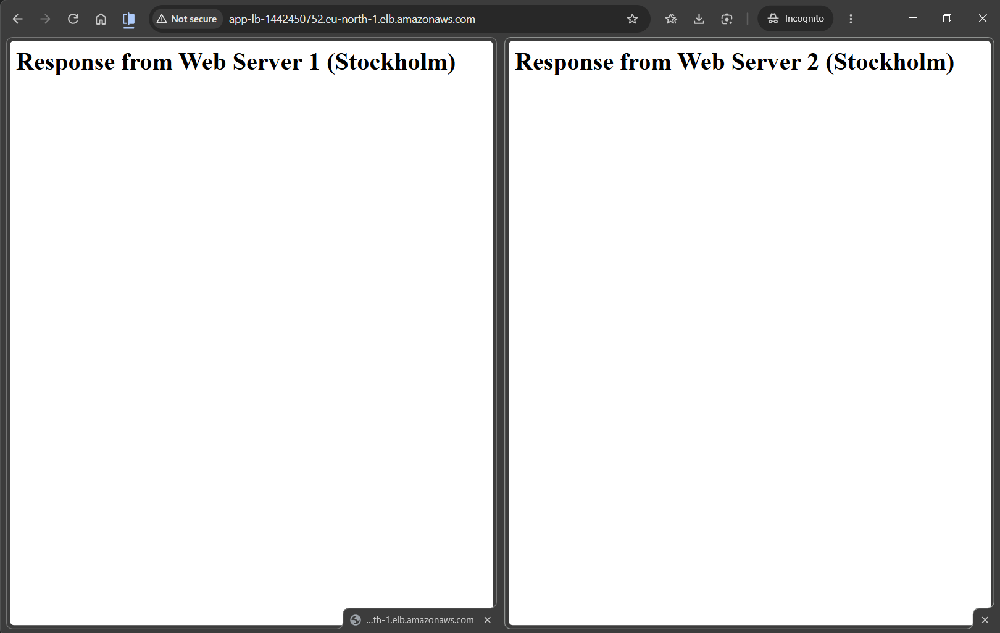

---

## How to Reproduce

1. Clone this repository:
   ```bash
   git clone https://github.com/1YUVARAJ1/aws-2tier-architecture.git
   cd aws-2tier-architecture
   ```
2. Initialize and deploy with Terraform:
   ```bash
   terraform init
   terraform apply -auto-approve
   ```
3. Test the output URL in your browser:
   ```bash
   curl http://<alb_dns_url>
   ```
4. Destroy infrastructure to prevent ongoing charges:
   ```bash
   terraform destroy -auto-approve
   ```